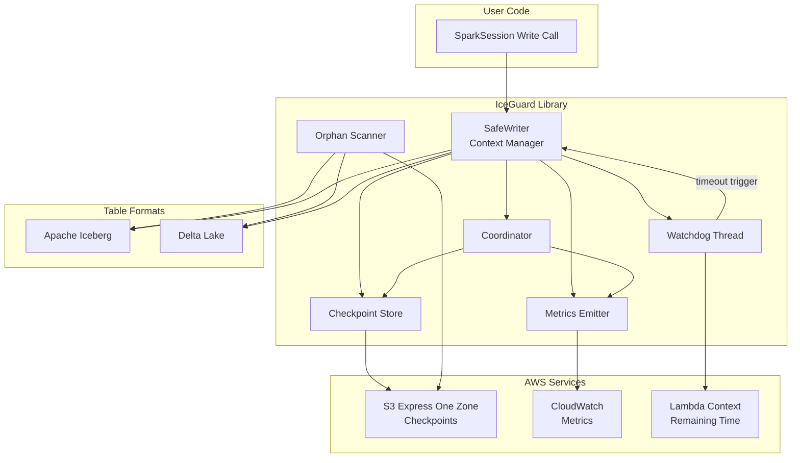
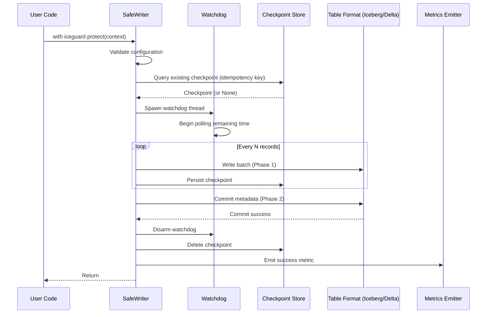
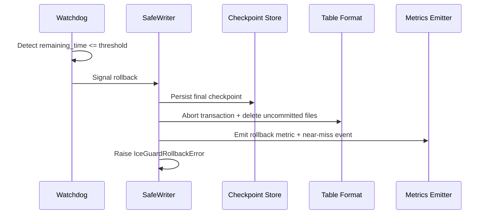
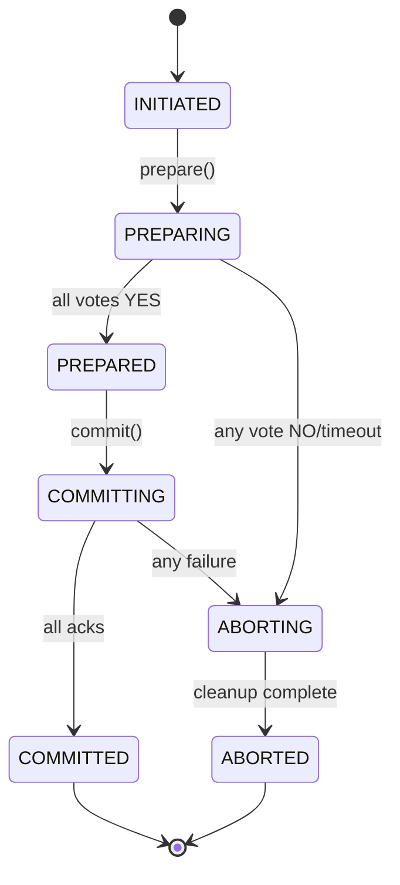

# Design Document: IceGuard

## Overview

IceGuard is a Python reliability library that prevents silent data loss in Spark-on-AWS-Lambda (SoAL) deployments. It wraps Spark write operations with a timeout-aware watchdog that triggers format-native rollback before Lambda's SIGKILL terminates the container. The library provides resumable checkpointing, orphan file cleanup, multi-Lambda coordination, and CloudWatch observability — all accessible via a two-line context manager integration.

### Design Goals

- **Zero silent data loss**: Detect impending timeout and roll back cleanly before SIGKILL
- **Minimal integration friction**: Drop-in context manager requiring ≤2 lines of code change
- **Resumability**: Persist progress to S3 Express One Zone so subsequent invocations continue where the last left off
- **Atomicity across Lambdas**: Two-phase commit protocol for coordinated multi-Lambda writes
- **Observability**: CloudWatch metrics for write outcomes, near-misses, orphan status, and checkpoint activity
- **Low overhead**: <100ms latency added to the normal write path

### Key Design Decisions

1. **Watchdog as a daemon thread**: Uses Python's `threading.Thread(daemon=True)` to monitor remaining time. Daemon threads are killed automatically when the main thread exits, preventing zombie threads.
2. **S3 Express One Zone for checkpoints**: Chosen for single-digit millisecond latency, critical for checkpoint writes that must complete before rollback.
3. **Format-native rollback**: Delegates rollback to Iceberg/Delta APIs rather than implementing custom file deletion, ensuring consistency with table format semantics.
4. **Fail-open on checkpoint unavailability**: If the checkpoint store is unreachable, the write proceeds without resume capability rather than failing entirely.
5. **Batched orphan scanning**: Processes files in batches of ≤1000 to stay within Lambda memory constraints.

## Architecture

### High-Level Component Diagram



### Data Flow: Normal Write Path



### Data Flow: Rollback Path



## Components and Interfaces

### 1. SafeWriter (Core Context Manager)

The primary entry point. Wraps a Spark write operation and orchestrates all other components.

```python
class SafeWriter:
    """Context manager that protects Spark writes from Lambda timeout."""

    def __init__(
        self,
        lambda_context: LambdaContext,
        table_format: TableFormat,
        config: IceGuardConfig,
        idempotency_key: Optional[str] = None,
    ) -> None: ...

    def __enter__(self) -> "SafeWriter": ...
    def __exit__(self, exc_type, exc_val, exc_tb) -> bool: ...

    def write(self, df: DataFrame, path: str, **kwargs) -> WriteResult: ...
    def checkpoint(self, offset: int, metadata: Dict[str, Any]) -> None: ...
    def disarm(self) -> None: ...
```

**Public API (module-level convenience)**:

```python
def protect(
    lambda_context: LambdaContext,
    table_format: str = "iceberg",
    rollback_threshold_ms: int = 30000,
    checkpoint_interval: int = 5000,
    idempotency_key: Optional[str] = None,
    s3_bucket: Optional[str] = None,
    coordinator_id: Optional[str] = None,
) -> SafeWriter: ...
```

### 2. Watchdog Thread

Monitors remaining Lambda execution time and signals rollback when threshold is breached.

```python
class WatchdogThread:
    """Daemon thread that monitors Lambda remaining time."""

    def __init__(
        self,
        lambda_context: LambdaContext,
        threshold_ms: int,
        callback: Callable[[], None],
        poll_interval_ms: int = 500,
    ) -> None: ...

    def start(self) -> None: ...
    def disarm(self) -> None: ...
    def is_armed(self) -> bool: ...
```

**Thread safety**: Uses `threading.Event` for disarm signaling. The callback is invoked at most once via `threading.Lock`.

### 3. Checkpoint Store

Persists and retrieves checkpoint metadata from S3 Express One Zone.

```python
class CheckpointStore:
    """S3 Express One Zone-backed checkpoint persistence."""

    def __init__(self, bucket: str, prefix: str = "iceguard/checkpoints/") -> None: ...

    def save(self, key: str, checkpoint: CheckpointData) -> None: ...
    def load(self, key: str) -> Optional[CheckpointData]: ...
    def delete(self, key: str) -> None: ...
    def health_check(self, timeout_ms: int = 5000) -> bool: ...
```

**Serialization**: Checkpoints are serialized to JSON. The store handles serialization/deserialization internally and raises `CheckpointCorruptionError` on malformed data.

### 4. Orphan Scanner

Detects and removes uncommitted Parquet files from table data directories.

```python
class OrphanScanner:
    """Scans for and removes orphaned data files."""

    def __init__(
        self,
        table_format: TableFormat,
        retention_hours: int = 72,
        batch_size: int = 1000,
    ) -> None: ...

    def scan(self, table_path: str) -> ScanResult: ...
    def delete_orphans(self, orphan_files: List[str]) -> DeleteResult: ...
```

**Strategy pattern**: Uses a `TableFormatAdapter` interface to abstract Iceberg vs. Delta metadata queries.

### 5. Coordinator

Orchestrates atomic multi-Lambda commits using two-phase commit.

```python
class Coordinator:
    """Two-phase commit coordinator for multi-Lambda writes."""

    def __init__(
        self,
        transaction_id: str,
        participants: List[str],
        checkpoint_store: CheckpointStore,
        timeout_ms: int = 60000,
    ) -> None: ...

    def prepare(self) -> PrepareResult: ...
    def commit(self) -> CommitResult: ...
    def abort(self) -> None: ...
    def recover(self, transaction_id: str) -> TransactionState: ...
```

**State machine**:



### 6. Metrics Emitter

Publishes structured metrics to CloudWatch under the `iceguard` namespace.

```python
class MetricsEmitter:
    """CloudWatch metrics publisher."""

    def __init__(self, namespace: str = "iceguard") -> None: ...

    def emit_write_outcome(
        self, table_name: str, table_format: str, outcome: str, function_name: str
    ) -> None: ...
    def emit_near_miss(self, remaining_time_ms: int) -> None: ...
    def emit_orphan_scan(self, found: int, deleted: int, total_bytes: int) -> None: ...
    def emit_checkpoint_resume(self, records_skipped: int) -> None: ...
    def emit_coordination_outcome(
        self, transaction_id: str, outcome: str, participant_count: int
    ) -> None: ...
```

**Fire-and-forget**: All emit methods catch exceptions internally and log failures without interrupting the write path.

### 7. Table Format Adapters

```python
class TableFormatAdapter(Protocol):
    """Protocol for table format-specific operations."""

    def abort_transaction(self, transaction: Any) -> None: ...
    def delete_uncommitted_files(self, file_paths: List[str]) -> None: ...
    def list_committed_files(self, table_path: str) -> Set[str]: ...
    def get_table_metadata_path(self, table_path: str) -> str: ...


class IcebergAdapter(TableFormatAdapter): ...
class DeltaLakeAdapter(TableFormatAdapter): ...
```

### 8. Configuration

```python
@dataclass(frozen=True)
class IceGuardConfig:
    """Validated configuration for IceGuard."""

    rollback_threshold_ms: int = 30000
    checkpoint_interval: int = 5000
    table_format: TableFormat = TableFormat.ICEBERG
    s3_bucket: Optional[str] = None
    s3_prefix: str = "iceguard/checkpoints/"
    orphan_retention_hours: int = 72
    orphan_batch_size: int = 1000
    coordinator_timeout_ms: int = 60000
    watchdog_poll_interval_ms: int = 500

    def __post_init__(self) -> None:
        """Validate all configuration values at construction time."""
        ...
```

## Data Models

### Checkpoint Schema

```python
@dataclass
class CheckpointData:
    """Checkpoint metadata persisted to S3."""

    idempotency_key: str
    table_path: str
    table_format: str  # "iceberg" | "delta"
    record_offset: int  # Number of records successfully processed
    partition_info: Dict[str, Any]  # Partition values for current write
    file_manifest: List[FileEntry]  # Files written so far
    created_at: str  # ISO 8601 timestamp
    lambda_function_name: str
    lambda_request_id: str
    schema_version: int = 1


@dataclass
class FileEntry:
    """A single file in the checkpoint manifest."""

    path: str
    size_bytes: int
    record_count: int
    checksum: str  # MD5 of file content
```

**JSON representation**:

```json
{
  "idempotency_key": "pipeline-x-batch-42",
  "table_path": "s3://lake/db/table",
  "table_format": "iceberg",
  "record_offset": 15000,
  "partition_info": {"date": "2024-01-15", "region": "us-east-1"},
  "file_manifest": [
    {
      "path": "s3://lake/db/table/data/part-00001.parquet",
      "size_bytes": 1048576,
      "record_count": 5000,
      "checksum": "abc123def456"
    }
  ],
  "created_at": "2024-01-15T10:30:00Z",
  "lambda_function_name": "spark-writer-fn",
  "lambda_request_id": "req-abc-123",
  "schema_version": 1
}
```

### Transaction State (Coordinator)

```python
@dataclass
class TransactionState:
    """Persisted state for two-phase commit coordination."""

    transaction_id: str
    status: TransactionStatus  # INITIATED | PREPARING | PREPARED | COMMITTING | COMMITTED | ABORTING | ABORTED
    participants: List[ParticipantState]
    created_at: str
    updated_at: str
    coordinator_lambda: str
    timeout_ms: int


@dataclass
class ParticipantState:
    """State of a single participant in a coordinated transaction."""

    participant_id: str
    lambda_function_name: str
    vote: Optional[str]  # "YES" | "NO" | None
    phase1_complete: bool
    phase2_complete: bool
    last_heartbeat: str


class TransactionStatus(Enum):
    INITIATED = "INITIATED"
    PREPARING = "PREPARING"
    PREPARED = "PREPARED"
    COMMITTING = "COMMITTING"
    COMMITTED = "COMMITTED"
    ABORTING = "ABORTING"
    ABORTED = "ABORTED"
```

### Metrics Data

```python
@dataclass
class WriteMetric:
    """Metric emitted on write completion."""

    table_name: str
    table_format: str
    outcome: str  # "success" | "rollback" | "error"
    function_name: str
    duration_ms: int
    records_written: int


@dataclass
class NearMissMetric:
    """Metric emitted when rollback prevents data loss."""

    remaining_time_ms: int
    threshold_ms: int
    table_name: str
    function_name: str


@dataclass
class OrphanScanMetric:
    """Metric emitted after orphan scan completion."""

    files_found: int
    files_deleted: int
    total_bytes: int
    scan_duration_ms: int
    table_name: str
```

## Correctness Properties

*A property is a characteristic or behavior that should hold true across all valid executions of a system — essentially, a formal statement about what the system should do. Properties serve as the bridge between human-readable specifications and machine-verifiable correctness guarantees.*

### Property 1: Watchdog rollback trigger

*For any* remaining execution time value and any configured rollback threshold, the watchdog SHALL trigger rollback if and only if remaining time is less than or equal to the threshold.

**Validates: Requirements 1.2**

### Property 2: Checkpoint serialization round-trip

*For any* valid CheckpointData object (containing record offsets, partition information, and file manifests), serializing to JSON and then deserializing back SHALL produce an object equivalent to the original.

**Validates: Requirements 7.1, 7.2, 7.3**

### Property 3: Malformed JSON raises CheckpointCorruptionError

*For any* byte string that is not valid JSON or does not conform to the CheckpointData schema, deserialization SHALL raise a CheckpointCorruptionError containing the file path and a description of the parsing failure.

**Validates: Requirements 7.4**

### Property 4: Checkpoint resume processes only remaining records

*For any* valid checkpoint with record offset N and a total dataset of M records (where N < M), resuming from that checkpoint SHALL process exactly (M - N) records and skip the first N records.

**Validates: Requirements 3.3, 3.4**

### Property 5: Checkpoint persistence at configured intervals

*For any* total record count and any configured checkpoint interval, the number of checkpoints persisted during a write SHALL equal floor(records_processed / interval), with each checkpoint occurring at the expected offset boundaries.

**Validates: Requirements 3.1**

### Property 6: Orphan file classification

*For any* set of files in a table's data directory and any set of committed file references in table metadata, a file SHALL be classified as an orphan if and only if it is not in the committed set AND its age exceeds the configured retention period.

**Validates: Requirements 4.1, 4.2**

### Property 7: Orphan scan batch size invariant

*For any* number of files to scan, the Orphan Scanner SHALL process files in batches where each batch contains at most 1000 files.

**Validates: Requirements 4.7**

### Property 8: Orphan scan metric accuracy

*For any* orphan scan result, the emitted metric SHALL contain values for files found, files deleted, and total bytes that exactly match the actual scan outcome.

**Validates: Requirements 4.6, 6.4**

### Property 9: Coordinator all-success triggers commit

*For any* set of N participants (N ≥ 1) in a coordinated transaction, if all N participants report Phase 1 success, the Coordinator SHALL instruct all N participants to proceed with Phase 2 commit.

**Validates: Requirements 5.2**

### Property 10: Coordinator any-failure triggers global abort

*For any* set of N participants in a coordinated transaction, if any participant reports failure OR fails to respond within the configured timeout, the Coordinator SHALL instruct ALL participants to abort and roll back.

**Validates: Requirements 5.3, 5.5**

### Property 11: Coordinator transaction state round-trip

*For any* valid TransactionState object, persisting to the Checkpoint Store and then recovering SHALL produce an equivalent TransactionState object.

**Validates: Requirements 5.6**

### Property 12: Coordinator unique transaction IDs

*For any* sequence of N coordinated writes initiated, all N assigned transaction identifiers SHALL be unique (no duplicates).

**Validates: Requirements 5.1**

### Property 13: Configuration validation — threshold range

*For any* integer value provided as Rollback_Threshold, the configuration SHALL be accepted if and only if the value is in the range [5000, 300000]. Values outside this range SHALL cause an IceGuardConfigError specifying the provided value and the valid range.

**Validates: Requirements 8.1, 8.2**

### Property 14: Configuration validation — table format

*For any* string value provided as Table_Format, the configuration SHALL be accepted if and only if the value is in the set {"iceberg", "delta"}. Unsupported values SHALL cause an IceGuardConfigError listing the supported formats.

**Validates: Requirements 8.3, 8.4**

### Property 15: Write metric dimensions completeness

*For any* write operation completion (success or rollback), the emitted CloudWatch metric SHALL contain all required dimensions: table name, table format, outcome, and Lambda function name.

**Validates: Requirements 6.1**

### Property 16: Rollback metric records exact remaining time

*For any* rollback event, the emitted near-miss metric SHALL record the exact remaining execution time (in milliseconds) at the moment rollback was triggered.

**Validates: Requirements 6.3**

### Property 17: Resume metric records exact skip count

*For any* checkpoint resume event where N records are skipped, the emitted metric SHALL report exactly N as the records skipped count.

**Validates: Requirements 6.5**

## Error Handling

### Error Hierarchy

```python
class IceGuardError(Exception):
    """Base exception for all IceGuard errors."""
    pass


class IceGuardInitializationError(IceGuardError):
    """Raised when IceGuard cannot initialize (e.g., watchdog thread fails to spawn)."""
    pass


class IceGuardContextError(IceGuardError):
    """Raised when Lambda context is missing or invalid."""
    pass


class IceGuardConfigError(IceGuardError):
    """Raised when configuration validation fails."""

    def __init__(self, message: str, field: str, value: Any, valid_range: Any = None):
        self.field = field
        self.value = value
        self.valid_range = valid_range
        super().__init__(message)


class IceGuardRollbackError(IceGuardError):
    """Raised when a rollback is triggered by the watchdog."""

    def __init__(self, remaining_time_ms: int, threshold_ms: int):
        self.remaining_time_ms = remaining_time_ms
        self.threshold_ms = threshold_ms
        super().__init__(
            f"Rollback triggered: {remaining_time_ms}ms remaining (threshold: {threshold_ms}ms)"
        )


class CheckpointCorruptionError(IceGuardError):
    """Raised when checkpoint data cannot be deserialized."""

    def __init__(self, file_path: str, reason: str):
        self.file_path = file_path
        self.reason = reason
        super().__init__(f"Corrupt checkpoint at {file_path}: {reason}")


class CoordinatorTimeoutError(IceGuardError):
    """Raised when a participant fails to respond within timeout."""

    def __init__(self, participant_id: str, timeout_ms: int):
        self.participant_id = participant_id
        self.timeout_ms = timeout_ms
        super().__init__(
            f"Participant {participant_id} timed out after {timeout_ms}ms"
        )
```

### Error Handling Strategy

| Component | Error Scenario | Behavior |
|-----------|---------------|----------|
| SafeWriter | Watchdog fails to spawn | Raise `IceGuardInitializationError`, prevent write |
| SafeWriter | Invalid Lambda context | Raise `IceGuardContextError` |
| SafeWriter | Config validation fails | Raise `IceGuardConfigError` |
| SafeWriter | Watchdog triggers rollback | Execute rollback, raise `IceGuardRollbackError` |
| Checkpoint Store | S3 unreachable on write | Log warning, proceed without checkpoint (fail-open) |
| Checkpoint Store | S3 unreachable on init | Raise `IceGuardConfigError` |
| Checkpoint Store | Malformed JSON on read | Raise `CheckpointCorruptionError` |
| Orphan Scanner | Delete permission denied | Log error, continue scanning remaining files |
| Orphan Scanner | S3 list API failure | Raise exception, abort scan |
| Coordinator | Participant timeout | Treat as failure, initiate global abort |
| Coordinator | Coordinator Lambda timeout | State persisted for recovery by next invocation |
| Metrics Emitter | CloudWatch publish failure | Log error, continue operation (fire-and-forget) |

### Design Principles

1. **Fail-fast on initialization**: Configuration errors, missing context, and thread spawn failures are caught immediately before any write begins.
2. **Fail-open on non-critical paths**: Checkpoint store unavailability and metrics publish failures do not block the write path.
3. **Fail-safe on timeout**: The watchdog always errs on the side of rolling back rather than risking SIGKILL.
4. **Idempotent recovery**: Coordinator and checkpoint recovery are designed to be safe to retry.

## Testing Strategy

### Property-Based Testing

**Library**: [Hypothesis](https://hypothesis.readthedocs.io/) (Python's standard PBT library)

**Configuration**: Minimum 100 examples per property test, with `@settings(max_examples=200)` for critical properties (serialization, config validation).

**Tag format**: Each property test is tagged with a comment:
```python
# Feature: iceguard, Property {N}: {property_text}
```

**Properties to implement**:

| Property | Module Under Test | Generator Strategy |
|----------|------------------|-------------------|
| 1: Watchdog rollback trigger | `WatchdogThread` | Random (remaining_time, threshold) pairs |
| 2: Checkpoint serialization round-trip | `CheckpointStore` | Random `CheckpointData` objects via `@composite` |
| 3: Malformed JSON raises error | `CheckpointStore` | Random byte strings + structurally invalid JSON |
| 4: Checkpoint resume | `SafeWriter` | Random (offset, total_records) pairs |
| 5: Checkpoint interval persistence | `SafeWriter` | Random (total_records, interval) pairs |
| 6: Orphan classification | `OrphanScanner` | Random (file_set, committed_set, ages, retention) |
| 7: Batch size invariant | `OrphanScanner` | Random file counts 1–10000 |
| 8: Orphan scan metric accuracy | `OrphanScanner` + `MetricsEmitter` | Random scan results |
| 9: All-success → commit | `Coordinator` | Random participant counts 1–20 |
| 10: Any-failure → abort | `Coordinator` | Random participant sets with random failures |
| 11: Transaction state round-trip | `Coordinator` | Random `TransactionState` objects |
| 12: Unique transaction IDs | `Coordinator` | Sequences of N transactions |
| 13: Config threshold range | `IceGuardConfig` | Random integers (full int range) |
| 14: Config table format | `IceGuardConfig` | Random strings |
| 15: Write metric dimensions | `MetricsEmitter` | Random write outcomes |
| 16: Rollback metric remaining time | `MetricsEmitter` | Random remaining_time values |
| 17: Resume metric skip count | `MetricsEmitter` | Random skip counts |

### Unit Tests (Example-Based)

- Default threshold value (30000ms) when not specified
- Context manager integration pattern (2-line usage)
- Watchdog disarm within 500ms after successful commit
- Checkpoint deletion after successful write
- Near-miss metric emission on rollback
- Two-phase commit state transitions (INITIATED → PREPARING → PREPARED → COMMITTING → COMMITTED)
- Both Iceberg and Delta adapter support

### Edge Case Tests

- Watchdog thread fails to spawn → `IceGuardInitializationError`
- Invalid Lambda context → `IceGuardContextError`
- S3 unreachable during write → warning logged, full write proceeds
- Orphan delete permission denied → error logged, scan continues
- CloudWatch publish failure → error logged, write not interrupted
- S3 connectivity timeout on init → `IceGuardConfigError`

### Integration Tests

- Iceberg rollback: abort transaction + delete uncommitted files
- Delta Lake rollback: abort transaction + delete uncommitted files
- S3 Express One Zone checkpoint read/write latency
- CloudWatch metric publication with correct namespace
- End-to-end coordinated write with multiple mock participants

### Test Organization

```
tests/
├── unit/
│   ├── test_safe_writer.py
│   ├── test_watchdog.py
│   ├── test_checkpoint_store.py
│   ├── test_orphan_scanner.py
│   ├── test_coordinator.py
│   ├── test_metrics_emitter.py
│   └── test_config.py
├── property/
│   ├── test_watchdog_properties.py
│   ├── test_checkpoint_properties.py
│   ├── test_orphan_properties.py
│   ├── test_coordinator_properties.py
│   ├── test_config_properties.py
│   └── test_metrics_properties.py
├── integration/
│   ├── test_iceberg_rollback.py
│   ├── test_delta_rollback.py
│   ├── test_s3_checkpoint.py
│   └── test_cloudwatch_metrics.py
└── conftest.py
```

