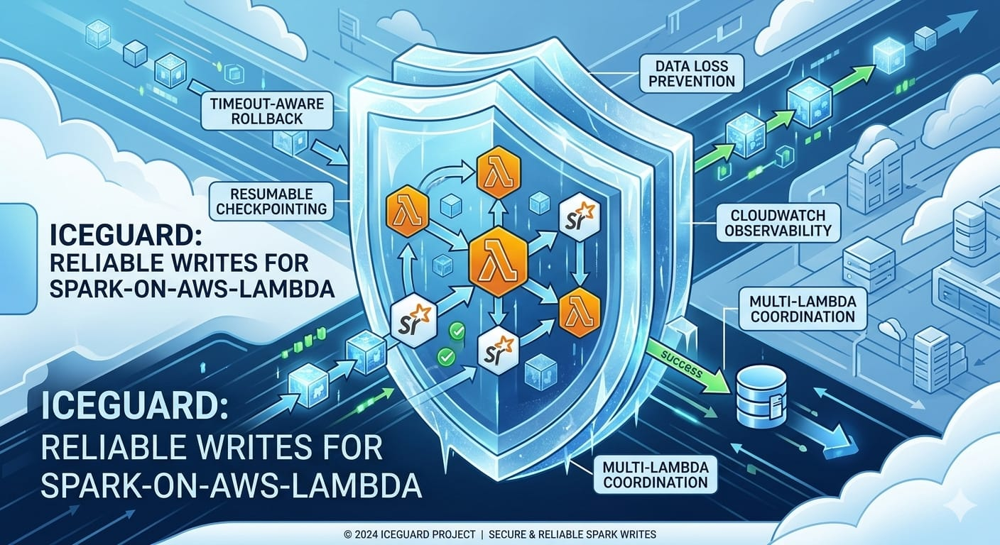
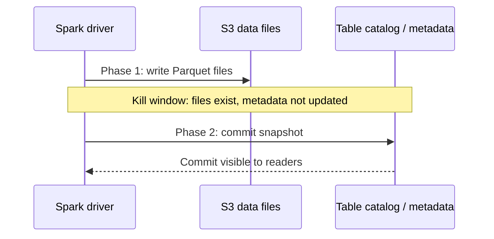
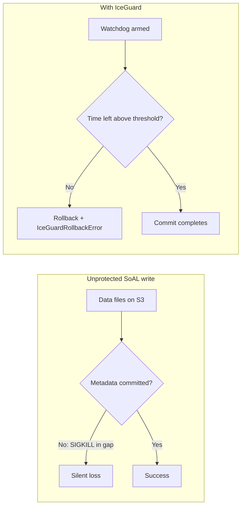
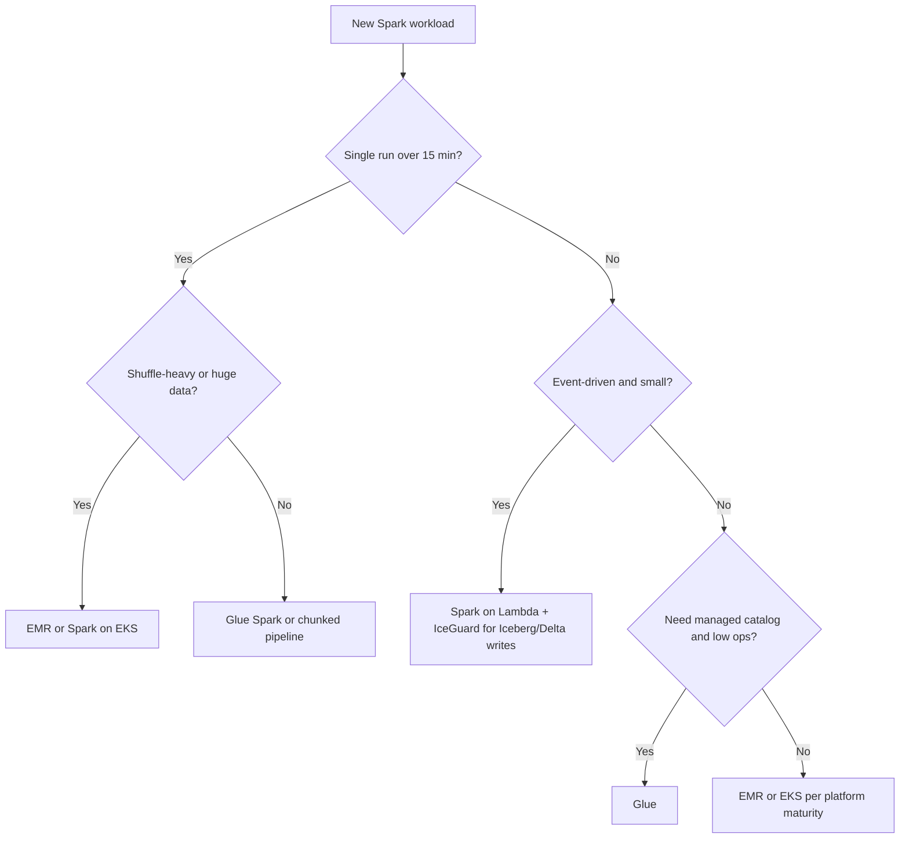
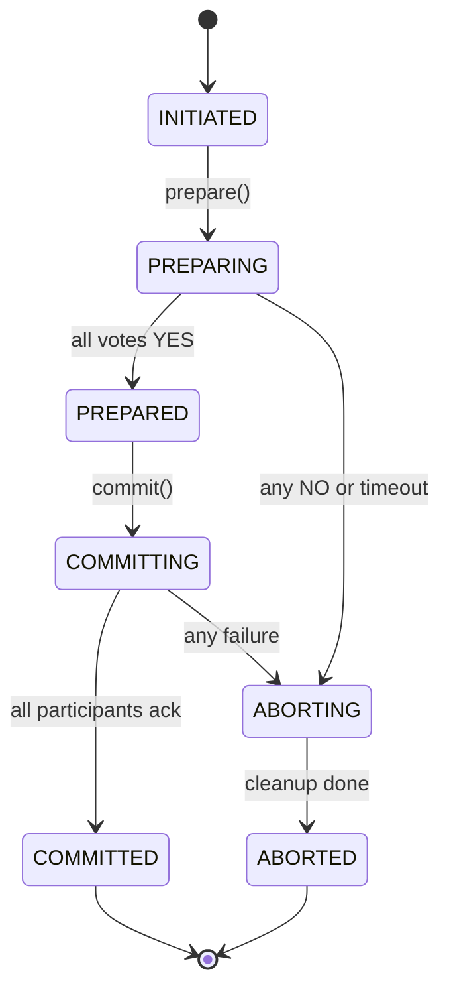
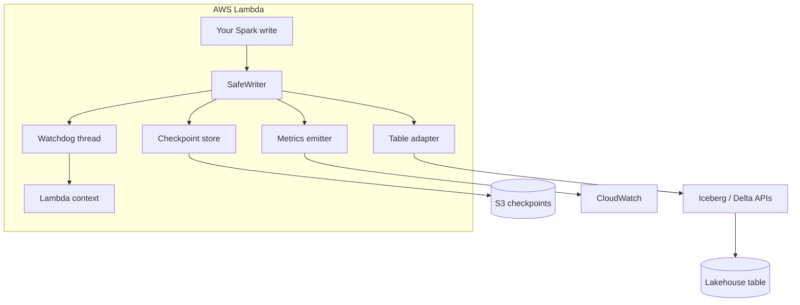
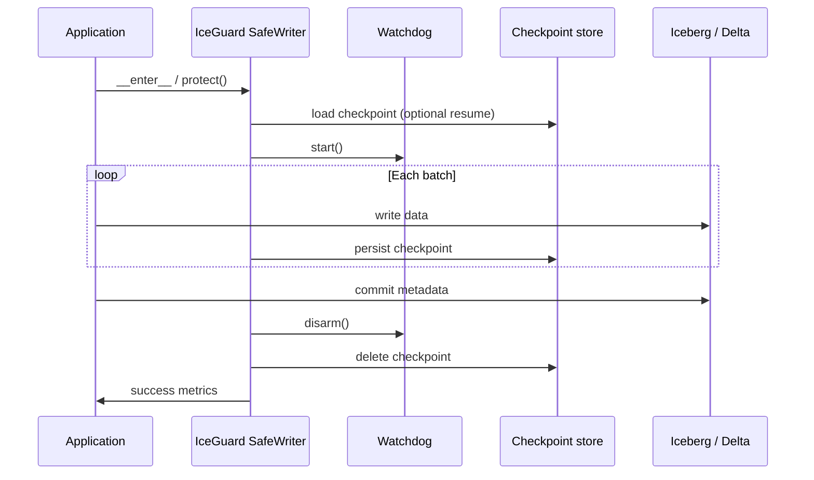
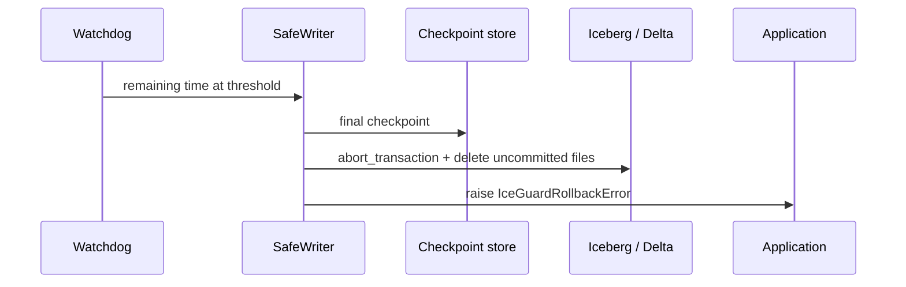

# IceGuard

**Reliability library for Spark-on-AWS-Lambda (SoAL) lakehouse writes.** IceGuard protects **chunked** writes under Lambda timeouts: watchdog rollback, S3 checkpoints, orphan cleanup on `s3://` paths, and optional CloudWatch metrics.

| Capability | Out of the box | You provide |
|------------|----------------|-------------|
| Timeout rollback between chunks | Yes (`SafeWriter.write`, `write_dataframe`) | PySpark in Lambda for Spark helper |
| Checkpoint resume (S3) | Yes | S3 bucket name |
| Delete uncommitted files on rollback | Yes for `s3://` paths in `track_paths` | Iceberg/Delta catalog for metadata abort |
| Orphan scan/delete | Yes for `s3://` table paths | Committed file set via adapter |
| Blocking single `df.write.save()` inside `protect()` only | **Not protected** | Use `write_dataframe` or `writer.write` |

---

## Research background: confirmed silent data loss

Spark-on-AWS-Lambda is widely used because it can cut batch cost versus managed EMR or Glue (often cited around **75–80%** savings). The trade-off is a hard platform constraint that open table formats were not designed around.

### The commit-durability gap

AWS Lambda enforces a **15-minute (900 s) maximum** execution time. When the limit is hit, the runtime terminates the container with **`SIGKILL` (signal 9)**, not `SIGTERM`. There is no graceful shutdown:

- Python cannot register a `SIGKILL` handler (`OSError` at install time).
- JVM `Runtime.addShutdownHook()` hooks never run.
- `atexit` and user cleanup code never runs.

Apache **Iceberg** and **Delta Lake** commit writes in two stages:

1. **Data phase:** write Parquet (or other) files to object storage (for example S3).
2. **Metadata phase:** update the table catalog or snapshot so readers can see those files.

If Lambda kills the process **between** these phases, data files can remain on S3 **without** a metadata pointer. From every normal check, the write **never happened**:

| What you check | What you see |
|----------------|--------------|
| Table queries / row counts | Unchanged (pre-kill state) |
| Application exceptions | None |
| CloudWatch | Timeout or exit, often indistinguishable from OOM (`-9`) |
| Downstream pipelines | May keep processing **stale** data |
| Storage | Orphan Parquet files accumulating with no readers |
| DLQ retries | Each retry can add more stranded files |

Researchers call this the **commit-durability gap**: bytes exist on disk, but the table’s logical state never advances, and **nothing alerts you that data was lost**.





### Experimental confirmation (arXiv)

Independent research systematically measured this failure mode:

**Paper:** [*Characterizing and Fixing Silent Data Loss in Spark-on-AWS-Lambda with Open Table Formats*](https://arxiv.org/abs/2604.20081) (arXiv:2604.20081), Srujan Kumar Gandla, 2026.

| Finding | Detail |
|---------|--------|
| Fault-injection runs | **860** controlled kills across **Delta Lake** and **Iceberg**, multiple dataset sizes |
| Unprotected writes in the commit window | **100%** produced silent data loss (no observable failure signal) |
| Proposed mitigation | **SafeWriter:** Python context manager with a watchdog ~30 s before timeout, format-native rollback, S3 checkpoint |
| Mitigation evaluation | **100** kill scenarios, **100%** clean rollback, **under 100 ms** average overhead on the write path |

The paper argues that SoAL and transactional lakehouse formats are each correct in isolation. The gap appears at their **boundary** when hard process termination lands inside a two-phase commit.

**Related public discussion**

- [AWS Samples: Spark on AWS Lambda](https://github.com/aws-samples/spark-on-aws-lambda): reference SoAL deployment pattern.
- [Apache Iceberg #9618](https://github.com/apache/iceberg/issues/9618): client-side timeouts and metadata commit edge cases on AWS.
- [AWS Big Data Blog: PyIceberg with Lambda](https://aws.amazon.com/blogs/big-data/accelerate-lightweight-analytics-using-pyiceberg-with-aws-lambda-and-an-aws-glue-iceberg-rest-endpoint/): Lambda plus Iceberg adoption (different failure surface, same timeout ceiling).

Community threads on X (Twitter) and LinkedIn often discuss SoAL cost savings. The **quantified silent-loss rate** in the table above comes from the arXiv fault-injection study, not from anecdotal posts alone. IceGuard implements the same class of safeguards (watchdog, rollback, checkpoints, observability).

### Why IceGuard

**IceGuard** is a production-oriented Python library that implements the **SafeWriter** pattern from that research, extended with:

- Resumable checkpoints (S3-backed `CheckpointData`)
- Orphan file scanning and batched deletion
- Multi-Lambda two-phase commit (`Coordinator`)
- CloudWatch metrics (`MetricsEmitter`)

Minimal integration:

```python
with iceguard.protect(lambda_context):
    ...
```

---

## When to use Glue, EMR, Lambda, EKS, and related options

There is no single best Spark runtime on AWS. The right choice depends on job duration, data size, how much control you need, operational maturity, and whether you are optimizing for cost per run or cost per month.

### Quick comparison

| Platform | Typical best for | Max practical job length | Ops burden | Cost model (rough) |
|----------|------------------|--------------------------|------------|-------------------|
| **AWS Glue** (Spark jobs) | Managed ETL, catalog integration, Iceberg via Glue 4.x+ | Hours (serverless autoscaling) | Low | DPU-hours + crawler/catalog extras |
| **Amazon EMR** (EC2 clusters) | Heavy batch, custom Spark configs, long shuffle-heavy jobs | Hours to days | Medium–high | Cluster hours (EC2 + EMR fee) |
| **EMR on EKS** | Same as EMR but on Kubernetes, shared K8s estate | Hours to days | High | EKS + EC2/Fargate + EMR on EKS |
| **Spark on Lambda (SoAL)** | Short, event-driven, bursty ETL; per-invocation billing | **15 min hard cap** per invocation | Medium (you own image + limits) | Per-ms Lambda + S3; often cheapest per small job |
| **Spark on EKS** (self-managed) | Platform teams, multi-tenant data platforms, GitOps | Limited by cluster/Pod policy | High | EKS + nodes + your platform team |
| **Glue Spark + Iceberg REST / PyIceberg on Lambda** | Lightweight metadata or small transforms, not full Spark clusters | Minutes (Lambda) or Glue limits | Low–medium | Mix of Glue and Lambda pricing |

### AWS Glue (managed Spark)

**Use Glue when:**

- You want a **fully managed** Spark runtime with minimal cluster tuning.
- Jobs are **scheduled or event-driven** through Glue Workflows, triggers, or Step Functions.
- You rely on the **Glue Data Catalog**, Lake Formation, or native **Iceberg/Delta** support in recent Glue versions.
- Team prefers **DPUs and autoscaling** over picking instance types.
- Job duration is **well under Glue limits** (typically minutes to a few hours) and shuffle needs are moderate.

**Avoid or reconsider Glue when:**

- You need **deep Spark tuning** (custom shuffle service, rare serializers, exotic connectors) that Glue blocks or lags on.
- Workloads are **very long** or need **fixed hardware** for predictable performance.
- You are already standardized on **Kubernetes** and want one control plane for all workloads.

### Amazon EMR (clusters on EC2)

**Use EMR when:**

- Jobs are **large**, **long-running**, or **shuffle-heavy** (joins, wide aggregations, ML feature pipelines).
- You need **specific instance families**, spot fleets, or **persistent HDFS** (legacy patterns).
- You want **full Spark, Hadoop, and Hive** ecosystem control with bootstrap actions and step concurrency.
- Runtime routinely **exceeds 15 minutes** or needs **more than 10 GB** driver memory in one process.

**Avoid or reconsider EMR when:**

- Workloads are **small and sporadic** (cluster startup cost dominates).
- You only need **simple transforms** and already pay for Glue catalog integration elsewhere.
- You lack staff to manage **cluster sizing, patching, and cost guardrails**.

### EMR on EKS

**Use EMR on EKS when:**

- The organization already runs **Kubernetes** for other services and wants Spark jobs as **virtual clusters** on shared nodes.
- You need **namespace isolation**, **resource quotas**, and **consistent deployment** with the rest of a data platform.
- Data engineering and platform engineering are the **same team** (or a strong platform team exists).

**Avoid or reconsider EMR on EKS when:**

- You do not have **K8s operational expertise** (networking, storage classes, autoscaling, observability).
- Jobs are **simple batch** and Glue or plain EMR would be faster to ship.

### Spark on AWS Lambda (SoAL)

**Use Spark on Lambda when:**

- Jobs are **short** (target **well under 15 minutes**, with headroom for commit and teardown).
- Workloads are **event-driven** (S3 upload, queue message, schedule with small input).
- You want **near-zero idle cost**: pay only when the function runs.
- Data size fits **Lambda memory** (up to 10 GB) and **local[*] Spark** on container vCPUs.
- You accept **chunking + checkpoints** (IceGuard or your own) for work that might span invocations.

**Use IceGuard on Lambda when:**

- You write to **Iceberg or Delta** and cannot afford the **commit-durability gap** on timeout.
- You need **visible rollback**, **resume after timeout**, or **metrics** on near-misses.

**Avoid or reconsider Lambda when:**

- Single-run processing **regularly approaches 15 minutes** without a proven chunking design.
- You need **large clusters**, **dynamic executor scaling**, or **long shuffle stages**.
- Debugging requires **persistent Spark UI** across long sessions on the same cluster.

### Spark on EKS (self-managed, not EMR on EKS)

**Use self-managed Spark on EKS when:**

- You own a **data platform** (Spark Operator, Kubeflow, custom controllers) and need **full lifecycle control**.
- Multiple teams submit jobs with **RBAC, quotas, and standardized images**.
- You integrate Spark with **service mesh, secrets, and CI/CD** the same way as microservices.

**Avoid or reconsider self-managed EKS when:**

- You only run **a handful of batch jobs** per day (Glue or EMR is simpler).
- You want AWS to operate the **Spark distribution and version matrix** for you.

### Other patterns (not full Spark clusters)

| Pattern | Use when |
|---------|----------|
| **Amazon Athena** | Interactive **SQL** on S3 tables; not a replacement for complex Spark DAGs. |
| **PyIceberg / lightweight Lambda** | Small **metadata** or **incremental** operations without booting full Spark. |
| **MWAA (Airflow)** | **Orchestration** only; still pick Glue, EMR, Lambda, or EKS as the execution engine. |
| **Step Functions** | Coordinate **multiple** engines (for example Lambda fan-out + Glue consolidation). |

### Decision flow (simplified)



### How IceGuard fits

IceGuard is **not** a replacement for Glue, EMR, or EKS. It is a **reliability layer for SoAL** (and similar Lambda-bound Spark writers) where hard timeouts meet two-phase table commits. If your architecture never uses Spark on Lambda, you do not need IceGuard on that path; use the platforms above instead.

---

## Features

### Timeout-aware rollback

- Daemon **watchdog** polls `lambda_context.get_remaining_time_in_millis()` (default every 500 ms, configurable 100–1000 ms).
- When remaining time is at or below **`rollback_threshold_ms`** (default 30 s, valid range 5–300 s), triggers **format-native** rollback via Iceberg or Delta adapters.
- Raises **`IceGuardRollbackError`** with exact remaining time so failures are **visible**, not silent.
- Rollback callback runs **at most once**; watchdog disarms on successful commit.

### Resumable checkpointing

- Persists **`CheckpointData`** (record offset, partition info, file manifest) to **S3** (standard S3 API; use a low-latency bucket in your account if needed).
- Next invocation with the same idempotency key **skips already-processed records** and emits resume metrics.
- Checkpoints at configurable **`checkpoint_interval`** (default every 5,000 records).
- **Fail-open** on checkpoint write failures during the job (write continues; resume may be unavailable).

### Orphan file cleanup

- For `s3://` table paths, **lists `.parquet` objects via boto3** by default; compares against committed sets from adapters.
- Classifies orphans when age exceeds **retention period** (default 72 hours).
- Deletes in batches of **up to 1,000** files per API call.
- Permission errors are **logged and skipped**; scan continues.

### Multi-Lambda coordination



- **Two-phase commit** state machine: `INITIATED → PREPARING → PREPARED → COMMITTING → COMMITTED` (or abort path to `ABORTED`).
- Any participant **NO** vote or **timeout** triggers global abort.
- Transaction state persisted to the checkpoint store for **recovery** after coordinator failure.
- Unique **UUID4** transaction IDs per coordinated write.

### Observability

- CloudWatch metrics under the **`iceguard`** namespace.
- Metric types: write outcomes, near-misses (rollback prevented loss), orphan scan summaries, checkpoint resume counts, coordination outcomes.
- **Opt-in CloudWatch** via `enable_cloudwatch_metrics=True` (default no-op). Publishes on a **background thread** so slow CloudWatch does not consume Lambda time on the write path.

### Table formats

| Format | Adapter |
|--------|---------|
| Apache Iceberg | `IcebergAdapter` |
| Delta Lake | `DeltaLakeAdapter` |

### Configuration and safety

- Frozen **`IceGuardConfig`** with validated thresholds, intervals, and table format.
- **`IceGuardContextError`** if Lambda context is missing or invalid.
- **`IceGuardInitializationError`** if the watchdog cannot start.
- **`CheckpointCorruptionError`** on malformed checkpoint JSON.
- **`CoordinatorTimeoutError`** when a participant does not respond in time.

### Public API

```python
import iceguard

iceguard.protect(lambda_context, ...)  # returns SafeWriter
iceguard.IceGuardConfig
iceguard.TableFormat
# Exceptions: IceGuardError, IceGuardRollbackError, IceGuardConfigError, ...
```

---

## Installation

IceGuard is **not on PyPI yet**. Install from GitHub:

```bash
pip install "git+https://github.com/vaquarkhan/IceGuard.git"
```

With Spark support (PySpark in your environment):

```bash
pip install "git+https://github.com/vaquarkhan/IceGuard.git[spark]"
```

Development checkout:

```bash
git clone git@github.com:vaquarkhan/IceGuard.git
cd IceGuard
pip install -e ".[dev,spark]"
```

---

## Quick start

IceGuard does **not** protect a single blocking `df.write.save(...)`. Rollback is checked between **chunks** via `SafeWriter.write(...)` or `iceguard.write_dataframe(...)`.

### Spark (recommended)

Requires PySpark in your Lambda image:

```python
import iceguard

TABLE = "s3://lake/db/table"

with iceguard.protect(
    lambda_context,
    table_format="iceberg",
    s3_bucket="my-checkpoint-bucket",
    catalog=my_iceberg_catalog,  # optional: abort_transaction / delete_files
    enable_cloudwatch_metrics=True,
) as writer:
    iceguard.write_dataframe(
        writer,
        df,
        TABLE,
        write_format="iceberg",
        write_mode="append",
        track_paths=lambda s, e: list_new_parquet_paths(s, e),
    )
```

`write_dataframe` adds a row-id column, counts rows, and calls `writer.write()` so each Spark batch can be interrupted by the watchdog.

### Manual chunks (no Spark helper)

```python
with iceguard.protect(lambda_context, s3_bucket="my-checkpoint-bucket") as writer:
    writer.write(
        path="s3://lake/db/table",
        total_records=N,
        batch_writer=lambda start, end: my_chunked_write(start, end),
        track_paths=lambda s, e: paths_written_in_chunk(s, e),
    )
```

### Orphan cleanup

```python
from iceguard import protect, scan_orphans, iceberg_adapter

adapter = iceberg_adapter(catalog=my_catalog, table_identifier="db.orders")
scan = scan_orphans("s3://lake/db/orders", adapter, retention_hours=72)
# scan, deleted = scan_orphans(..., delete=True)
```

### Rollback and storage behavior

- **Watchdog:** daemon thread; fires `IceGuardRollbackError` when time is at or below threshold (including on `__enter__` if already low).
- **Adapters:** with `catalog` / `delta_log`, delegate abort/delete to your table library; with `table_identifier` + `[iceberg]`, committed files come from PyIceberg; otherwise **S3 paths in `track_paths` are deleted via boto3**.
- **Orphan scan:** `scan_orphans()` lists/deletes under `s3://` by default.
- **Metrics:** off by default (`NullMetricsEmitter`); `enable_cloudwatch_metrics=True` uses a **background thread** so CloudWatch latency does not block writes.

### Review checklist (what is fixed vs not)

| Item | Status |
|------|--------|
| Watchdog init vs rollback | Fixed |
| Property tests without AWS / fast | Fixed |
| Honest README + `write_dataframe` | Fixed |
| Async CloudWatch when enabled | Fixed |
| S3 rollback deletes + default orphan scan | Fixed |
| `orphan_batch_size` / scanner `batch_size` > 1000 | Rejected at config construction |
| `IceGuardConfig` string `table_format` | Fixed |
| Python 3.13 | Supported in `pyproject.toml` |
| PyPI `pip install iceguard` | **Not published** — install from GitHub |
| One-shot `df.write.save()` inside `protect()` only | **Not possible** without rewriting Spark; use chunked APIs |
| Full Iceberg/Delta metadata abort without your catalog | **Requires** your catalog/log or PyIceberg `[iceberg]` extra |

Run local checks: `python validation/run_all.py`

---

## Development

```bash
pip install -e ".[dev]"
pytest tests/unit tests/integration    # fast feedback
pytest tests                           # full suite including Hypothesis property tests
```

---

## Architecture (high level)



### Write paths

**Successful write**



**Rollback before timeout**



---

## Requirements

- Python **3.9–3.12**
- AWS **Lambda** execution environment (`get_remaining_time_in_millis()`)
- **boto3** (S3 checkpoints, CloudWatch metrics)

---

## License

MIT
