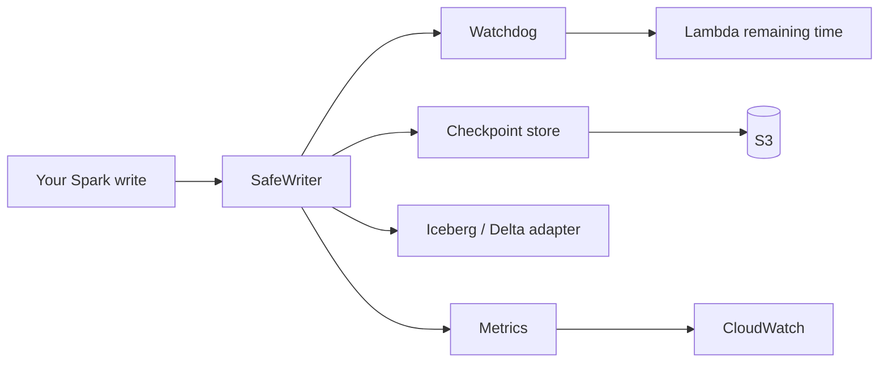

# IceGuard

**Reliability library for Spark-on-AWS-Lambda (SoAL) lakehouse writes.** IceGuard wraps your write path with timeout-aware rollback, resumable checkpoints, orphan cleanup, multi-Lambda coordination, and CloudWatch metrics so a Lambda `SIGKILL` does not leave you with silent data loss.

---

## Research background: confirmed silent data loss

Spark-on-AWS-Lambda is widely used because it can cut batch cost versus managed EMR or Glue (often cited around **75–80%** savings). The trade-off is a hard platform constraint that open table formats were not designed around.

### The commit-durability gap

AWS Lambda enforces a **15-minute (900 s) maximum** execution time. When the limit is hit, the runtime terminates the container with **`SIGKILL` (signal 9)**, not `SIGTERM`. There is no graceful shutdown:

- Python cannot register a `SIGKILL` handler (`OSError` at install time).
- JVM `Runtime.addShutdownHook()` hooks never run.
- `atexit` and user cleanup code never runs.

Apache **Iceberg** and **Delta Lake** commit writes in two stages:

1. **Data phase:** write Parquet (or other) files to object storage (for example S3).
2. **Metadata phase:** update the table catalog or snapshot so readers can see those files.

If Lambda kills the process **between** these phases, data files can remain on S3 **without** a metadata pointer. From every normal check, the write **never happened**:

| What you check | What you see |
|----------------|--------------|
| Table queries / row counts | Unchanged (pre-kill state) |
| Application exceptions | None |
| CloudWatch | Timeout or exit, often indistinguishable from OOM (`-9`) |
| Downstream pipelines | May keep processing **stale** data |
| Storage | Orphan Parquet files accumulating with no readers |
| DLQ retries | Each retry can add more stranded files |

Researchers call this the **commit-durability gap**: bytes exist on disk, but the table’s logical state never advances, and **nothing alerts you that data was lost**.

### Experimental confirmation (arXiv)

Independent research systematically measured this failure mode:

**Paper:** [*Characterizing and Fixing Silent Data Loss in Spark-on-AWS-Lambda with Open Table Formats*](https://arxiv.org/abs/2604.20081) (arXiv:2604.20081), Srujan Kumar Gandla, 2026.

| Finding | Detail |
|---------|--------|
| Fault-injection runs | **860** controlled kills across **Delta Lake** and **Iceberg**, multiple dataset sizes |
| Unprotected writes in the commit window | **100%** produced silent data loss (no observable failure signal) |
| Proposed mitigation | **SafeWriter:** Python context manager with a watchdog ~30 s before timeout, format-native rollback, S3 checkpoint |
| Mitigation evaluation | **100** kill scenarios, **100%** clean rollback, **under 100 ms** average overhead on the write path |

The paper argues that SoAL and transactional lakehouse formats are each correct in isolation. The gap appears at their **boundary** when hard process termination lands inside a two-phase commit.

**Related public discussion**

- [AWS Samples: Spark on AWS Lambda](https://github.com/aws-samples/spark-on-aws-lambda): reference SoAL deployment pattern.
- [Apache Iceberg #9618](https://github.com/apache/iceberg/issues/9618): client-side timeouts and metadata commit edge cases on AWS.
- [AWS Big Data Blog: PyIceberg with Lambda](https://aws.amazon.com/blogs/big-data/accelerate-lightweight-analytics-using-pyiceberg-with-aws-lambda-and-an-aws-glue-iceberg-rest-endpoint/): Lambda plus Iceberg adoption (different failure surface, same timeout ceiling).

Community threads on X (Twitter) and LinkedIn often discuss SoAL cost savings. The **quantified silent-loss rate** in the table above comes from the arXiv fault-injection study, not from anecdotal posts alone. IceGuard implements the same class of safeguards (watchdog, rollback, checkpoints, observability).

### Why IceGuard

**IceGuard** is a production-oriented Python library that implements the **SafeWriter** pattern from that research, extended with:

- Resumable checkpoints (S3-backed `CheckpointData`)
- Orphan file scanning and batched deletion
- Multi-Lambda two-phase commit (`Coordinator`)
- CloudWatch metrics (`MetricsEmitter`)

Minimal integration:

```python
with iceguard.protect(lambda_context):
    ...
```

---

## Features

### Timeout-aware rollback

- Daemon **watchdog** polls `lambda_context.get_remaining_time_in_millis()` (default every 500 ms, configurable 100–1000 ms).
- When remaining time is at or below **`rollback_threshold_ms`** (default 30 s, valid range 5–300 s), triggers **format-native** rollback via Iceberg or Delta adapters.
- Raises **`IceGuardRollbackError`** with exact remaining time so failures are **visible**, not silent.
- Rollback callback runs **at most once**; watchdog disarms on successful commit.

### Resumable checkpointing

- Persists **`CheckpointData`** (record offset, partition info, file manifest) to **S3** (compatible with S3 Express One Zone style low-latency buckets).
- Next invocation with the same idempotency key **skips already-processed records** and emits resume metrics.
- Checkpoints at configurable **`checkpoint_interval`** (default every 5,000 records).
- **Fail-open** on checkpoint write failures during the job (write continues; resume may be unavailable).

### Orphan file cleanup

- Lists candidate files under a table path, compares against **committed** sets from table metadata via adapters.
- Classifies orphans when age exceeds **retention period** (default 72 hours).
- Deletes in batches of **up to 1,000** files per API call.
- Permission errors are **logged and skipped**; scan continues.

### Multi-Lambda coordination

- **Two-phase commit** state machine: `INITIATED → PREPARING → PREPARED → COMMITTING → COMMITTED` (or abort path to `ABORTED`).
- Any participant **NO** vote or **timeout** triggers global abort.
- Transaction state persisted to the checkpoint store for **recovery** after coordinator failure.
- Unique **UUID4** transaction IDs per coordinated write.

### Observability

- CloudWatch metrics under the **`iceguard`** namespace.
- Metric types: write outcomes, near-misses (rollback prevented loss), orphan scan summaries, checkpoint resume counts, coordination outcomes.
- **Fire-and-forget** publishing: metric failures never block the write path.

### Table formats

| Format | Adapter |
|--------|---------|
| Apache Iceberg | `IcebergAdapter` |
| Delta Lake | `DeltaLakeAdapter` |

### Configuration and safety

- Frozen **`IceGuardConfig`** with validated thresholds, intervals, and table format.
- **`IceGuardContextError`** if Lambda context is missing or invalid.
- **`IceGuardInitializationError`** if the watchdog cannot start.
- **`CheckpointCorruptionError`** on malformed checkpoint JSON.
- **`CoordinatorTimeoutError`** when a participant does not respond in time.

### Public API

```python
import iceguard

iceguard.protect(lambda_context, ...)  # returns SafeWriter
iceguard.IceGuardConfig
iceguard.TableFormat
# Exceptions: IceGuardError, IceGuardRollbackError, IceGuardConfigError, ...
```

---

## Installation

```bash
pip install iceguard
```

From source:

```bash
git clone git@github.com:vaquarkhan/IceGuard.git
cd IceGuard
pip install -e ".[dev]"
```

---

## Quick start

```python
import iceguard

with iceguard.protect(lambda_context):
    # Your existing Spark write code here
    df.write.format("iceberg").save("s3://lake/db/table")
```

With explicit options and chunked writes:

```python
with iceguard.protect(
    lambda_context,
    table_format="iceberg",       # or "delta"
    rollback_threshold_ms=30_000,
    checkpoint_interval=5_000,
    s3_bucket="my-express-bucket",
    idempotency_key="pipeline-batch-42",
) as writer:
    writer.write(
        path="s3://lake/db/table",
        total_records=1_000_000,
        batch_writer=lambda start, end: write_slice(start, end),
    )
```

---

## Development

```bash
pip install -e ".[dev]"
pytest tests/unit tests/integration    # fast feedback
pytest tests                           # full suite including Hypothesis property tests
```

---

## Architecture (high level)



---

## Requirements

- Python **3.9–3.12**
- AWS **Lambda** execution environment (`get_remaining_time_in_millis()`)
- **boto3** (S3 checkpoints, CloudWatch metrics)

---

## References

1. S. K. Gandla, [*Characterizing and Fixing Silent Data Loss in Spark-on-AWS-Lambda with Open Table Formats*](https://arxiv.org/abs/2604.20081), arXiv:2604.20081, 2026.
2. AWS Samples, [spark-on-aws-lambda](https://github.com/aws-samples/spark-on-aws-lambda).
3. Apache Iceberg, [Glue timeout / metadata_location issues #9618](https://github.com/apache/iceberg/issues/9618).

---

## License

MIT
