# IceGuard Tutorial: Silent Data Loss in Spark-on-AWS-Lambda

## The Problem Nobody Talks About

You run Spark on AWS Lambda to save 75-80% on batch ETL costs. Your job writes
Parquet files to an Iceberg or Delta Lake table on S3. Everything looks fine in
CloudWatch, until one day you notice your downstream dashboards are missing data.
No errors. No alerts. No exceptions in your code. The data simply vanished.

**This is silent data loss**, and it happens every time Lambda kills your Spark
job between writing data files and committing metadata.

---

## Table of Contents

1. [Understanding the Root Cause](#1-understanding-the-root-cause)
2. [Reproducing the Problem](#2-reproducing-the-problem)
3. [Why Standard Monitoring Fails](#3-why-standard-monitoring-fails)
4. [How IceGuard Solves It](#4-how-iceguard-solves-it)
5. [Step-by-Step Integration](#5-step-by-step-integration)
6. [Advanced Features](#6-advanced-features)
7. [Why This Is a Must-Have](#7-why-this-is-a-must-have)
8. [Conclusion](#8-conclusion)

---

## 1. Understanding the Root Cause

### How Iceberg/Delta Writes Work (Two-Phase Commit)

Every write to an Iceberg or Delta table happens in two stages:

**Figure 1: Two-Phase Commit Protocol in Open Table Formats**

The diagram below illustrates the standard write protocol used by both Apache Iceberg and Delta Lake. The Spark driver first uploads data files (Parquet) to object storage (S3), then issues a metadata commit to make those files visible to readers. The gap between these two operations is where silent data loss occurs.

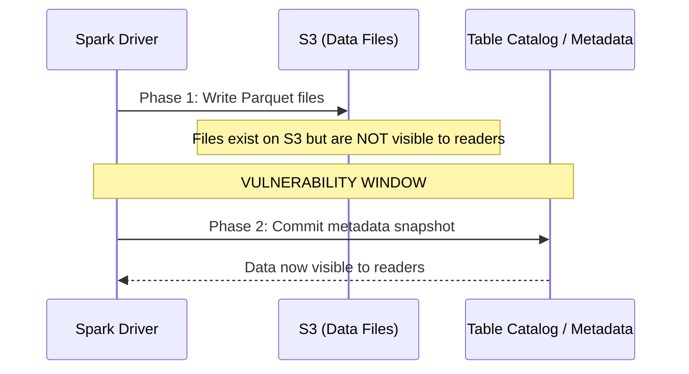

This is by design. It provides ACID guarantees. But it creates a **vulnerability
window** between Phase 1 and Phase 2.

### How Lambda Kills Your Process

AWS Lambda has a hard 15-minute (900 second) maximum execution time. When time
runs out:

- Lambda sends **SIGKILL (signal 9)**, NOT SIGTERM
- Python cannot catch or handle SIGKILL
- `atexit` handlers do NOT run
- `try/finally` blocks do NOT execute
- JVM shutdown hooks do NOT fire
- Your process is terminated instantly with zero cleanup

```python
# This code NEVER runs on Lambda timeout:
import signal
signal.signal(signal.SIGKILL, handler)  # Raises OSError, impossible to register

import atexit
atexit.register(cleanup)  # Never called on SIGKILL

try:
    write_data()
finally:
    commit_or_rollback()  # Never reached on SIGKILL
```

### The Kill Window

**Figure 2: Lambda Execution Timeline and the Kill Window**

This Gantt chart shows a typical 15-minute Lambda execution. Phase 1 (writing Parquet files) consumes most of the time. Phase 2 (metadata commit) is fast but must complete atomically. The critical section (shown in red) is the window where a SIGKILL produces silent data loss: files exist on S3 but the table's logical state never advances.

```mermaid
gantt
    title Lambda Execution Timeline (15 min max)
    dateFormat X
    axisFormat %s

    section Write Phases
    Phase 1 - Write Parquet to S3    :a1, 0, 840
    Phase 2 - Commit Metadata        :a2, 840, 870

    section Lambda
    SIGKILL at 900s                  :milestone, 900, 0

    section Kill Window
    SILENT LOSS if killed here       :crit, 840, 900
```

**Figure 3: Outcome Comparison, Unprotected vs Protected**

This flowchart contrasts the two possible outcomes. Without IceGuard (left), a SIGKILL in the commit gap leads to silent data loss with no observable failure signal. With IceGuard (right), the watchdog detects the approaching timeout and triggers a clean rollback with a visible error, preventing any data from being silently lost.
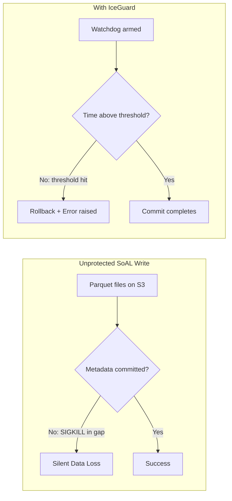

The arXiv paper ([2604.20081](https://arxiv.org/abs/2604.20081)) tested this with
860 controlled kill-injection experiments. **100% of kills in the commit window
produced silent data loss** for both Iceberg and Delta Lake.

---

## 2. Reproducing the Problem

### Prerequisites

- AWS account with Lambda + S3 access
- Python 3.9+ with PySpark
- An Iceberg or Delta table on S3

### Reproduction Script (No IceGuard)

This demonstrates the exact failure mode. Save as `reproduce_silent_loss.py`:

```python
"""
Reproduce silent data loss on Spark-on-Lambda.

Deploy this as a Lambda function with:
- 10 GB memory
- 2 minute timeout (short, to trigger kill quickly)
- PySpark in the container image
"""
import time
from pyspark.sql import SparkSession

def handler(event, context):
    spark = SparkSession.builder \
        .appName("SilentLossDemo") \
        .config("spark.sql.catalog.demo", "org.apache.iceberg.spark.SparkCatalog") \
        .config("spark.sql.catalog.demo.type", "hadoop") \
        .config("spark.sql.catalog.demo.warehouse", "s3://your-bucket/warehouse") \
        .getOrCreate()

    # Generate a large DataFrame that takes time to write
    df = spark.range(0, 10_000_000).toDF("id") \
        .withColumn("value", (col("id") * 3.14).cast("double")) \
        .withColumn("category", (col("id") % 100).cast("string"))

    # This write has TWO phases internally:
    # 1. Write Parquet files to S3 (takes most of the time)
    # 2. Commit metadata snapshot (fast, but must complete)
    df.write.format("iceberg").mode("append").save("demo.db.events")

    # If Lambda kills us between phase 1 and phase 2:
    # - Parquet files exist on S3 (orphans)
    # - Table metadata unchanged (data "lost")
    # - No exception raised
    # - CloudWatch shows: "Task timed out after 120.00 seconds"
    # - Downstream: processes STALE data silently

    return {"status": "success", "records": 10_000_000}
```

### What Happens After the Kill

```
$ aws s3 ls s3://your-bucket/warehouse/db/events/data/ --recursive
2026-05-20 10:15:01   45MB part-00000-abc123.parquet   ORPHAN (no metadata points here)
2026-05-20 10:15:03   45MB part-00001-def456.parquet   ORPHAN
2026-05-20 10:15:05   45MB part-00002-ghi789.parquet   ORPHAN

$ # Query the table. Data is NOT there:
spark.sql("SELECT count(*) FROM demo.db.events").show()
# +--------+
# |count(1)|
# +--------+
# |       0|    Zero! The write "never happened"
# +--------+
```

### Local Reproduction (Without Real Lambda)

You can simulate this locally using the IceGuard test infrastructure.
Reference: [`IceGuard/tests/unit/test_safe_writer.py::test_rollback_triggers`](../IceGuard/tests/unit/test_safe_writer.py)

```python
"""Local reproduction of the timeout scenario using IceGuard's test mocks."""
from unittest.mock import MagicMock
from iceguard.adapters import IcebergAdapter
from iceguard.config import IceGuardConfig
from iceguard.exceptions import IceGuardRollbackError
from iceguard.metrics import NullMetricsEmitter
from iceguard.safe_writer import SafeWriter

# Simulate a Lambda context where time is almost up
ctx = MagicMock()
ctx.get_remaining_time_in_millis.return_value = 3000  # Only 3 seconds left!
ctx.function_name = "my-etl-function"
ctx.aws_request_id = "req-abc-123"

# Configure IceGuard with 5-second threshold
config = IceGuardConfig(rollback_threshold_ms=5000)
adapter = IcebergAdapter()

writer = SafeWriter(ctx, config, adapter, metrics_emitter=NullMetricsEmitter())

try:
    writer.__enter__()
except IceGuardRollbackError as e:
    print(f"PROTECTED! Rollback triggered: {e.remaining_time_ms}ms remaining")
    print(f"Threshold was: {e.threshold_ms}ms")
    # This is what IceGuard does: makes the failure VISIBLE
```

Output:
```
PROTECTED! Rollback triggered: 3000ms remaining
Threshold was: 5000ms
```

Reference: [`IceGuard/tests/unit/test_safe_writer_enter.py`](../IceGuard/tests/unit/test_safe_writer_enter.py)

### Reproducing the Watchdog Trigger Mid-Write

Reference: [`IceGuard/tests/unit/test_safe_writer.py::test_rollback_triggers`](../IceGuard/tests/unit/test_safe_writer.py)

```python
"""Simulate watchdog firing DURING a chunked write."""
import threading
from unittest.mock import MagicMock
from iceguard.adapters import IcebergAdapter
from iceguard.config import IceGuardConfig
from iceguard.exceptions import IceGuardRollbackError
from iceguard.metrics import NullMetricsEmitter
from iceguard.safe_writer import SafeWriter

# Lambda context that starts with plenty of time, then drops
remaining = [60000]  # Start with 60 seconds

def get_remaining():
    val = remaining[0]
    remaining[0] -= 10000  # Each call, 10 seconds pass
    return val

ctx = MagicMock()
ctx.get_remaining_time_in_millis.side_effect = get_remaining
ctx.function_name = "my-etl"
ctx.aws_request_id = "req-456"

config = IceGuardConfig(
    rollback_threshold_ms=30000,   # Trigger at 30s remaining
    checkpoint_interval=1000,       # Checkpoint every 1000 records
)
adapter = IcebergAdapter()
writer = SafeWriter(ctx, config, adapter, metrics_emitter=NullMetricsEmitter())

batches_written = []

try:
    with writer:
        writer.write(
            path="s3://lake/db/table",
            total_records=50000,
            batch_writer=lambda start, end: batches_written.append((start, end)),
        )
except IceGuardRollbackError as e:
    print(f"Rollback at {e.remaining_time_ms}ms remaining!")
    print(f"Batches completed before rollback: {len(batches_written)}")
    print(f"Records safely checkpointed: {batches_written[-1][1] if batches_written else 0}")
```

---

## 3. Why Standard Monitoring Fails

### What CloudWatch Shows You

When Lambda times out, CloudWatch logs show:

```
REPORT RequestId: abc-123
Duration: 120000.00 ms
Billed Duration: 120000 ms
Memory Size: 10240 MB
Max Memory Used: 8192 MB
Status: TIMEOUT

"Task timed out after 120.00 seconds"
```

That's it. No stack trace. No indication of WHERE in the write it died.
No way to know if data files were written but metadata wasn't committed.

### What You DON'T See

**Figure 4: The Monitoring Black Hole**

This flowchart demonstrates why standard AWS monitoring completely fails to detect silent data loss. Each monitoring signal that could alert you is absent because SIGKILL prevents any application-level reporting. The result is total blindness: data is lost and nobody knows.

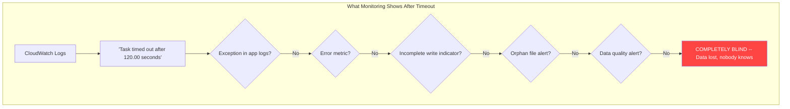

| Signal | Present? | Why |
|--------|----------|-----|
| Exception in application logs | No | SIGKILL prevents any logging |
| Error metric in CloudWatch | No | Function didn't "error", it timed out |
| Incomplete write indicator | No | Table metadata shows no change |
| Orphan file alert | No | S3 doesn't know files are orphans |
| Downstream data quality alert | No | Data looks "normal", just stale |

### The Insidious Part

**Figure 5: The Retry Amplification Problem**

Without IceGuard, retries make the problem worse, not better. Each retry attempt writes new Parquet files that become orphans when SIGKILL hits again. The table remains empty while S3 storage costs grow with every failed attempt. Standard retry mechanisms (DLQ, Step Functions, EventBridge) have no awareness of this failure mode.

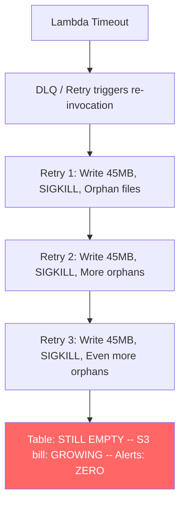

Your retry logic (DLQ, Step Functions, EventBridge retry) will re-invoke the
Lambda. The SAME thing can happen again: more orphan files, still no committed
data. Each retry adds more stranded Parquet files to S3 that you're paying for
but nobody can read.

---

## 4. How IceGuard Solves It

### The Core Idea

Instead of one blocking `df.write.save()` call, IceGuard:

1. **Chunks** the write into small batches
2. **Watches** remaining Lambda time on a background thread
3. **Checkpoints** progress to S3 after each batch
4. **Rolls back** cleanly if time is running out
5. **Raises a visible error** so your monitoring catches it
6. **Resumes** from the last checkpoint on the next invocation

### Architecture

**Figure 6: IceGuard Component Architecture**

This diagram shows how IceGuard's components fit within an AWS Lambda execution environment. The SafeWriter is the central orchestrator that coordinates the watchdog thread (time monitoring), checkpoint store (S3 persistence), table adapter (format-native rollback), and metrics emitter (CloudWatch observability). All components are pure Python with no additional infrastructure required.

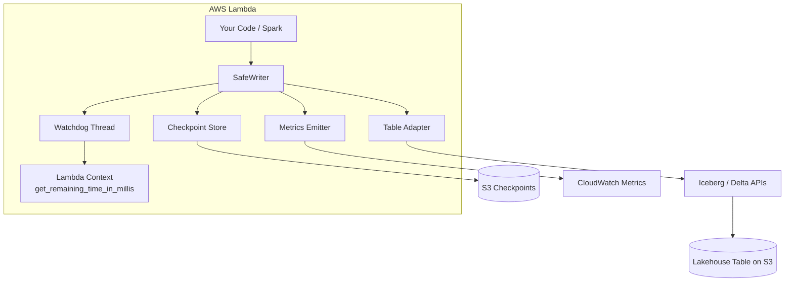

### Timeline: Protected Write

**Figure 7: Rollback Sequence, First Invocation**

This sequence diagram shows the complete lifecycle of a protected write that gets interrupted. The SafeWriter processes batches in a loop, checkpointing after each one. When the watchdog detects remaining time at or below the threshold, it fires the rollback event. The SafeWriter then performs an orderly shutdown: saves a final checkpoint, aborts the transaction, deletes uncommitted files, and raises a visible error.

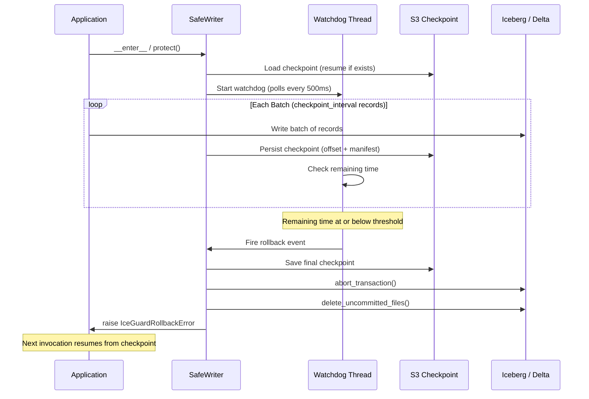

**Figure 8: Resume Sequence, Second Invocation**

This diagram shows what happens on the retry invocation. Using the same idempotency key, the SafeWriter loads the persisted checkpoint, discovers the previous offset (e.g., 45000 records), and skips all already-processed records. It then continues writing from where it left off, commits the metadata successfully, and deletes the checkpoint to signal completion.

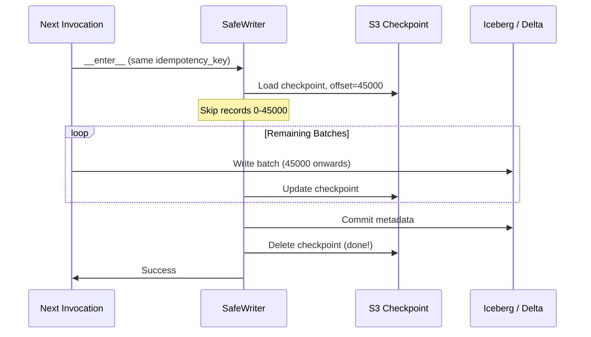

### Code Reference: The Watchdog

Source: [`IceGuard/src/iceguard/watchdog.py`](../IceGuard/src/iceguard/watchdog.py)

```python
# Simplified view of what the watchdog does:
class WatchdogThread:
    def _run(self):
        while not self._stop.is_set():
            remaining = self._ctx.get_remaining_time_in_millis()
            if remaining <= self._threshold_ms:
                self._callback()  # Sets the rollback event
                break
            time.sleep(self._poll_interval_ms / 1000.0)
```

The watchdog polls every 500ms (configurable 100-1000ms). When remaining time
hits the threshold, it fires a callback that sets a `threading.Event`. The
`SafeWriter.write()` loop checks this event between batches.

### Code Reference: The Rollback Handler

Source: [`IceGuard/src/iceguard/safe_writer.py::_handle_rollback`](../IceGuard/src/iceguard/safe_writer.py)

```python
# What happens when rollback triggers:
def _handle_rollback(self, path, remaining_ms):
    # 1. Save final checkpoint (for resume)
    self._store.save(key, final_checkpoint)

    # 2. Abort any active transaction
    self._adapter.abort_transaction(None)

    # 3. Delete uncommitted files from S3
    self._adapter.delete_uncommitted_files(manifest_paths)

    # 4. Emit metrics (near-miss + rollback outcome)
    self._metrics.emit_near_miss(remaining_ms, ...)
    self._metrics.emit_write_outcome(path, format, "rollback", ...)

    # 5. Raise visible error
    raise IceGuardRollbackError(remaining_ms, threshold_ms)
```

---

## 5. Step-by-Step Integration

### Step 1: Install IceGuard

```bash
# From GitHub (current)
pip install "git+https://github.com/vaquarkhan/IceGuard.git"

# With PySpark support
pip install "git+https://github.com/vaquarkhan/IceGuard.git[spark]"

# With PyIceberg committed-file discovery
pip install "git+https://github.com/vaquarkhan/IceGuard.git[iceberg]"

# Development
git clone https://github.com/vaquarkhan/IceGuard.git
cd IceGuard
pip install -e ".[dev,spark,iceberg]"
```

### Step 2: Basic Protection (Chunked Write)

```python
"""Lambda handler with IceGuard protection."""
import iceguard

def handler(event, context):
    TABLE = "s3://my-lake/db/events"
    TOTAL_RECORDS = event.get("record_count", 100000)

    with iceguard.protect(
        context,                          # Lambda context (required)
        table_format="iceberg",           # or "delta"
        rollback_threshold_ms=30000,      # Trigger rollback 30s before timeout
        checkpoint_interval=5000,         # Checkpoint every 5000 records
        s3_bucket="my-checkpoint-bucket", # S3 bucket for checkpoints
        idempotency_key=event.get("batch_id"),  # For resume across invocations
    ) as writer:
        writer.write(
            path=TABLE,
            total_records=TOTAL_RECORDS,
            batch_writer=lambda start, end: write_batch(start, end, TABLE),
        )

    return {"status": "success", "records": TOTAL_RECORDS}


def write_batch(start: int, end: int, table: str):
    """Your actual write logic for records [start, end)."""
    # This is where you write a chunk of data
    # Could be Spark, PyIceberg, pandas, or any writer
    pass
```

### Step 3: Spark DataFrame Protection

Reference: [`IceGuard/src/iceguard/spark_write.py`](../IceGuard/src/iceguard/spark_write.py)

```python
"""Lambda handler with Spark DataFrame + IceGuard."""
import iceguard
from pyspark.sql import SparkSession

def handler(event, context):
    spark = SparkSession.builder.appName("ProtectedWrite").getOrCreate()

    # Your DataFrame (from Kafka, S3, API, etc.)
    df = spark.read.parquet("s3://source/incoming/")

    TABLE = "s3://my-lake/db/events"

    with iceguard.protect(
        context,
        table_format="iceberg",
        s3_bucket="my-checkpoint-bucket",
        rollback_threshold_ms=30000,
        checkpoint_interval=10000,
        enable_cloudwatch_metrics=True,  # Opt-in metrics
    ) as writer:
        # write_dataframe chunks the DF and calls writer.write() internally
        iceguard.write_dataframe(
            writer,
            df,
            TABLE,
            write_format="iceberg",
            write_mode="append",
        )

    return {"status": "success"}
```

### Step 4: With Rollback Error Handling

```python
"""Production handler with retry awareness."""
import iceguard
from iceguard import IceGuardRollbackError

def handler(event, context):
    try:
        with iceguard.protect(
            context,
            s3_bucket="my-checkpoint-bucket",
            idempotency_key=event["batch_id"],  # SAME key across retries
        ) as writer:
            writer.write(
                path="s3://lake/db/table",
                total_records=event["total"],
                batch_writer=my_batch_writer,
            )
        return {"status": "success"}

    except IceGuardRollbackError as e:
        # This is NOT a bug. IceGuard saved you from silent loss.
        return {
            "status": "rollback",
            "remaining_ms": e.remaining_time_ms,
            "threshold_ms": e.threshold_ms,
            "message": "Write rolled back safely. Will resume on next invocation.",
        }
```

### Step 5: Resume After Rollback

The checkpoint mechanism enables work to span multiple Lambda invocations without data loss or duplication. Invocation 1 processes records until the watchdog triggers, saves a checkpoint at the current offset, and raises a rollback error. Invocation 2 (triggered by retry) loads that checkpoint, skips already-processed records, completes the remaining work, and commits successfully.

**Figure 9: Cross-Invocation Resume Flow**

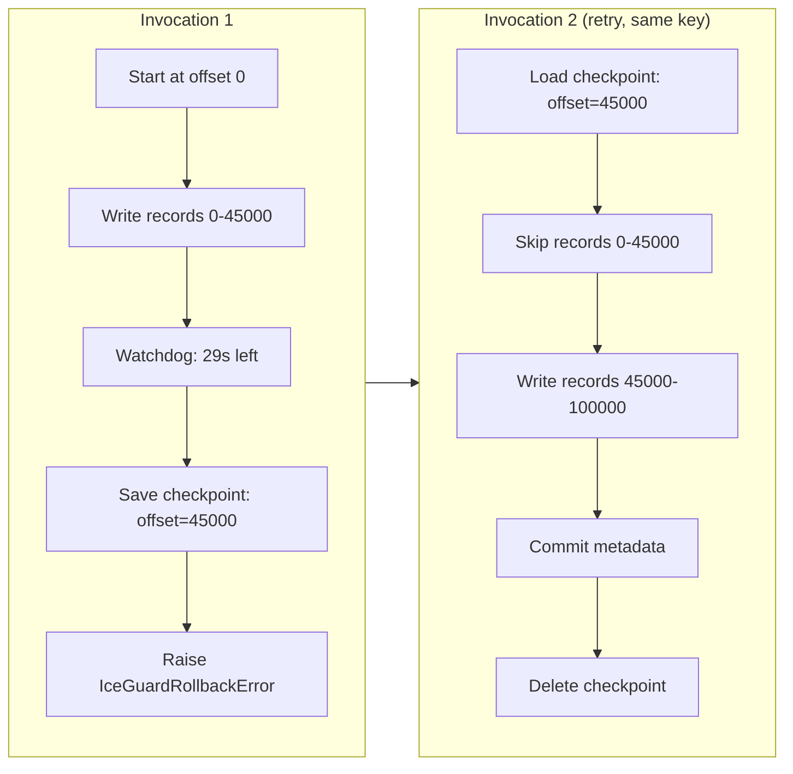

Reference: [`IceGuard/tests/property/test_safe_writer_properties.py::test_property_4_resume_skips_first_n_records`](../IceGuard/tests/property/test_safe_writer_properties.py)

### Step 6: Orphan Cleanup

Reference: [`IceGuard/src/iceguard/orphan_scanner.py`](../IceGuard/src/iceguard/orphan_scanner.py)
Reference: [`IceGuard/src/iceguard/s3_ops.py`](../IceGuard/src/iceguard/s3_ops.py)

```python
"""Scheduled orphan cleanup (run daily or weekly)."""
import iceguard

def cleanup_handler(event, context):
    adapter = iceguard.iceberg_adapter(
        catalog=my_catalog,
        table_identifier="db.events",
    )

    # Scan for orphan files older than 72 hours
    scan_result = iceguard.scan_orphans(
        "s3://my-lake/db/events",
        adapter,
        retention_hours=72,
        batch_size=1000,
    )

    print(f"Found {len(scan_result.orphan_files)} orphans")
    print(f"Total wasted storage: {scan_result.total_orphan_bytes / 1024 / 1024:.1f} MB")

    # Delete them (destructive operation)
    scan_result, delete_result = iceguard.scan_orphans(
        "s3://my-lake/db/events",
        adapter,
        retention_hours=72,
        delete=True,
    )

    return {
        "orphans_found": len(scan_result.orphan_files),
        "deleted": delete_result.deleted,
        "failed": delete_result.failed,
        "bytes_recovered": scan_result.total_orphan_bytes,
    }
```

---

## 6. Advanced Features

### Multi-Lambda Coordination (Two-Phase Commit)

When multiple Lambda functions write to the same table simultaneously, IceGuard provides a two-phase commit coordinator that ensures atomicity across all participants.

**Figure 10: Coordinator State Machine**

This state diagram shows the lifecycle of a coordinated transaction. The coordinator moves through well-defined states: from INITIATED through PREPARING (collecting votes) to either PREPARED (all YES) or ABORTING (any NO or timeout). A prepared transaction then moves to COMMITTING and finally COMMITTED. Any failure at any stage triggers the abort path, ensuring no partial commits.

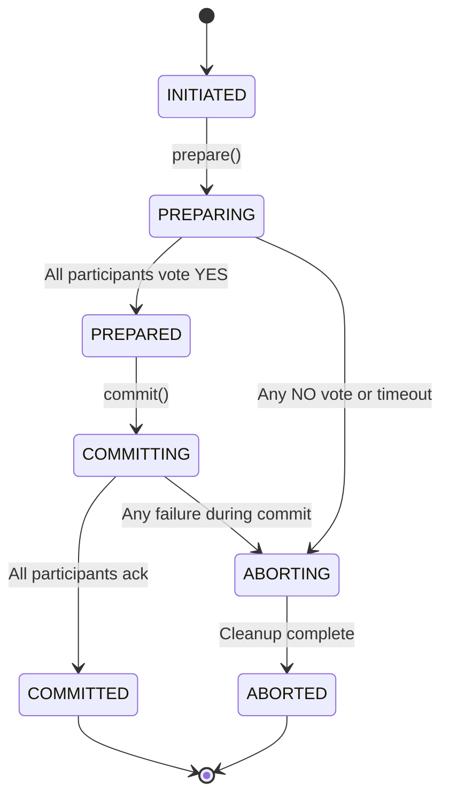

**Figure 11: Two-Phase Commit Message Flow**

This sequence diagram shows the actual message exchange between the coordinator Lambda and its participants. The coordinator persists state to S3 at each transition, enabling recovery if the coordinator itself fails. Each participant votes independently, and all must agree before the commit phase begins.

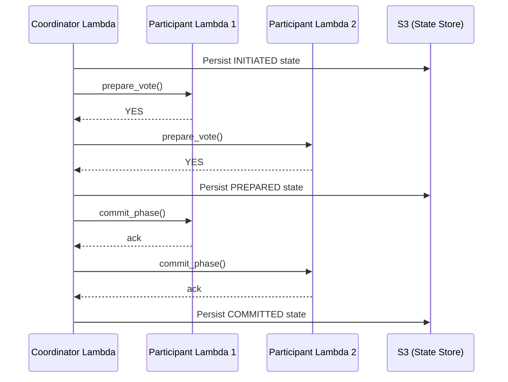

Reference: [`IceGuard/src/iceguard/coordinator.py`](../IceGuard/src/iceguard/coordinator.py)
Reference: [`IceGuard/tests/unit/test_coordinator.py`](../IceGuard/tests/unit/test_coordinator.py)

```python
"""Coordinated write across multiple Lambda functions."""
from iceguard.coordinator import Coordinator
from iceguard.checkpoint_store import CheckpointStore

store = CheckpointStore("my-checkpoint-bucket")

# Each participant is a Lambda that can vote YES/NO
participants = [lambda_writer_1, lambda_writer_2, lambda_writer_3]

coordinator = Coordinator(
    participants,
    store,
    timeout_ms=60000,
    metrics_emitter=my_metrics,
)

# Phase 1: Collect votes
state = coordinator.prepare()
# If any participant votes NO or times out, automatic abort follows

# Phase 2: Commit all
if state.status.value == "PREPARED":
    final = coordinator.commit()
    # All participants committed atomically
```

### CloudWatch Observability

Reference: [`IceGuard/src/iceguard/metrics.py`](../IceGuard/src/iceguard/metrics.py)
Reference: [`IceGuard/tests/unit/test_background_metrics.py`](../IceGuard/tests/unit/test_background_metrics.py)

```python
# Metrics are opt-in and non-blocking (background thread)
with iceguard.protect(
    context,
    enable_cloudwatch_metrics=True,  # Publishes to "iceguard" namespace
) as writer:
    writer.write(...)

# Metrics emitted:
# - WriteOutcome (success/rollback) with table name, format, function
# - NearMiss (remaining time when rollback triggered)
# - CheckpointResume (records skipped on resume)
# - OrphanScanFound / OrphanScanDeleted / OrphanScanBytes
# - CoordinationOutcome (committed/aborted with participant count)
```

### Configuration Validation

Reference: [`IceGuard/src/iceguard/config.py`](../IceGuard/src/iceguard/config.py)
Reference: [`IceGuard/tests/unit/test_config.py`](../IceGuard/tests/unit/test_config.py)

```python
from iceguard import IceGuardConfig

# All values validated at construction time
config = IceGuardConfig(
    rollback_threshold_ms=30000,      # Must be 5000-300000
    checkpoint_interval=5000,          # Must be positive integer
    table_format="iceberg",            # "iceberg" or "delta" (string or enum)
    s3_bucket="my-bucket",             # Optional
    orphan_retention_hours=72,         # Must be positive
    orphan_batch_size=1000,            # Must be 1-1000 (S3 API limit)
    coordinator_timeout_ms=60000,      # Must be positive
    watchdog_poll_interval_ms=500,     # Must be 100-1000
)

# Invalid values raise IceGuardConfigError with field name + valid range:
try:
    IceGuardConfig(rollback_threshold_ms=1000)  # Below minimum 5000
except IceGuardConfigError as e:
    print(e.field)        # "rollback_threshold_ms"
    print(e.value)        # 1000
    print(e.valid_range)  # (5000, 300000)
```

### Exception Hierarchy

Reference: [`IceGuard/src/iceguard/exceptions.py`](../IceGuard/src/iceguard/exceptions.py)
Reference: [`IceGuard/tests/unit/test_exceptions.py`](../IceGuard/tests/unit/test_exceptions.py)

**Figure 12: IceGuard Exception Class Hierarchy**

All IceGuard exceptions inherit from a single base class, enabling callers to catch all library errors with one `except IceGuardError` clause. Each subclass carries structured attributes (field names, values, thresholds) that provide actionable context for error handling and observability.

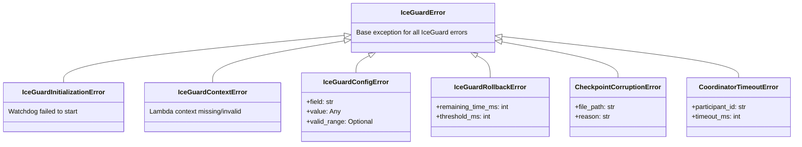

---

## 7. Why This Is a Must-Have

### The Cost of NOT Using IceGuard

| Impact | Without IceGuard | With IceGuard |
|--------|-----------------|---------------|
| Data loss detection | Days/weeks (manual discovery) | Immediate (`IceGuardRollbackError`) |
| Orphan file cost | Grows silently ($$$) | Cleaned up automatically |
| Retry behavior | Each retry creates MORE orphans | Resumes from checkpoint |
| Downstream impact | Stale data processed silently | Pipeline pauses on error |
| Root cause analysis | "Task timed out", no context | Exact remaining time + table + function |
| Recovery time | Manual investigation + rewrite | Automatic resume on next invocation |
| Monitoring | No signal at all | CloudWatch metrics + alerts |

**Figure 13: Impact Comparison: Without vs With IceGuard**

This side-by-side flowchart summarizes the operational difference. Without IceGuard (left), a timeout cascades into silent data loss that may not be discovered for days or weeks. With IceGuard (right), the same timeout is intercepted, cleaned up, checkpointed, and surfaced as a visible error that the next invocation can resume from.

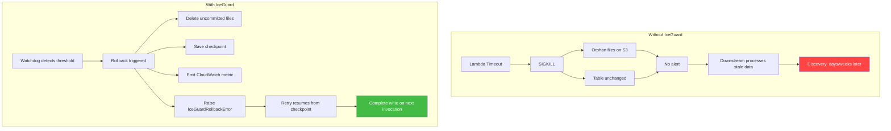

### Who Needs This

You need IceGuard if ALL of these are true:

1. You run **Spark on AWS Lambda** (or any short-lived compute writing to lakehouse tables)
2. You write to **Apache Iceberg** or **Delta Lake** tables
3. Your writes can take **more than a few minutes** (risk of hitting timeout)
4. You care about **data completeness** (not just "did the function run?")

### Who Does NOT Need This

- You use **AWS Glue** or **EMR** (no hard SIGKILL timeout)
- Your Lambda only **reads** data (no write = no commit gap)
- Your writes complete in **under 1 minute** (no timeout risk)
- You write to **non-transactional** storage (plain S3 files without table format)

### The Research Backing

The arXiv paper ([2604.20081](https://arxiv.org/abs/2604.20081)) provides:

- **860 fault-injection experiments** across Delta Lake and Iceberg
- **100% silent data loss rate** when kill lands in the commit window
- **100% clean rollback** with SafeWriter protection
- **Under 100ms overhead** on the normal write path

This is not theoretical. It is experimentally proven with controlled kills at
multiple dataset sizes.

### Why Not Just Use Lambda Durable Functions?

AWS Lambda Durable Functions (GA 2026) provide checkpoint + replay for workflows.
But they:

- Don't understand Iceberg/Delta commit protocols
- Don't provide write-time watchdog monitoring
- Don't clean up orphan files
- Don't integrate with table format rollback APIs
- Require adopting a new SDK and programming model
- Are designed for orchestration, not data write protection

IceGuard is complementary. You could use Durable Functions for orchestration
AND IceGuard for write protection within each step.

---

## 8. Conclusion

### The Problem Is Real

Silent data loss in Spark-on-AWS-Lambda is not a theoretical risk. It is an experimentally confirmed vulnerability that affects every team writing to Iceberg or Delta Lake tables from Lambda functions. The arXiv paper (2604.20081) demonstrated a 100% silent loss rate across 860 controlled experiments when SIGKILL lands in the commit window. No existing AWS service, table format feature, or monitoring tool detects or prevents this failure at write time.

### The Solution Works

IceGuard converts an invisible, unrecoverable failure into a visible, resumable error. The watchdog thread detects the approaching timeout before SIGKILL arrives. The checkpoint store enables the next invocation to resume without re-processing. The adapter layer cleans up uncommitted files so no orphans accumulate. The metrics emitter provides observability into near-miss events that would otherwise go unnoticed.

### Key Takeaways

1. **A single blocking `df.write.save()` cannot be protected on Lambda.** The write must be chunked so the watchdog can interrupt between batches. Use `writer.write()` or `write_dataframe()`.

2. **The idempotency key is critical for resume.** Use a stable identifier (batch ID, event ID) that remains the same across retries. Without it, each invocation starts from scratch.

3. **Rollback is a success, not a failure.** When `IceGuardRollbackError` is raised, IceGuard has prevented silent data loss. The correct response is to let the retry mechanism re-invoke with the same idempotency key.

4. **Orphan cleanup is a separate concern.** Even with IceGuard, historical orphans from before adoption (or from other writers) should be cleaned up on a schedule using `scan_orphans()`.

5. **Metrics are opt-in by design.** The default `NullMetricsEmitter` ensures IceGuard never makes network calls you did not ask for. Enable CloudWatch explicitly when you want observability.

### When to Adopt

Adopt IceGuard immediately if your Spark-on-Lambda jobs write to Iceberg or Delta tables and any of the following are true:

- Write duration is unpredictable or approaches the Lambda timeout
- Data completeness is a business requirement (finance, healthcare, compliance)
- You have observed unexplained data gaps in downstream systems
- Your retry logic re-invokes Lambda functions that write to lakehouse tables
- You are paying for S3 storage that grows faster than expected (orphan accumulation)

### Further Reading

| Resource | Link |
|----------|------|
| arXiv Paper | [Characterizing and Fixing Silent Data Loss in Spark-on-AWS-Lambda](https://arxiv.org/abs/2604.20081) |
| AWS Reference Architecture | [aws-samples/spark-on-aws-lambda](https://github.com/aws-samples/spark-on-aws-lambda) |
| IceGuard Source Code | [github.com/vaquarkhan/IceGuard](https://github.com/vaquarkhan/IceGuard) |
| Apache Iceberg Maintenance | [Iceberg Table Maintenance Docs](https://iceberg.apache.org/docs/nightly/maintenance/) |
| Lambda Execution Lifecycle | [AWS Lambda Runtime Environment](https://docs.aws.amazon.com/lambda/latest/dg/lambda-runtime-environment.html) |

---

## Appendix: Running the Validation Suite

To verify everything works on your machine:

```bash
cd IceGuard

# Install
pip install -e ".[dev]"

# Run all tests (119 tests, approximately 16 seconds)
pytest tests/ -v

# Run validation script (no AWS needed)
python validation/run_all.py

# Run with coverage
pytest tests/ --cov=iceguard --cov-report=term-missing
```

Expected output:
```
=================== 119 passed in 16.03s ===================
```

Validation script output:
```
IceGuard validation

PASS  watchdog_started_ok_after_fire
PASS  enter_raises_rollback_when_below_threshold
PASS  background_metrics_non_blocking
PASS  adapter_deletes_s3_paths
PASS  config_accepts_string_table_format

All validation checks passed.
```

---

## List of Figures

| Figure | Title | Section |
|--------|-------|---------|
| 1 | Two-Phase Commit Protocol in Open Table Formats | 1. Understanding the Root Cause |
| 2 | Lambda Execution Timeline and the Kill Window | 1. Understanding the Root Cause |
| 3 | Outcome Comparison: Unprotected vs Protected | 1. Understanding the Root Cause |
| 4 | The Monitoring Black Hole | 3. Why Standard Monitoring Fails |
| 5 | The Retry Amplification Problem | 3. Why Standard Monitoring Fails |
| 6 | IceGuard Component Architecture | 4. How IceGuard Solves It |
| 7 | Rollback Sequence: First Invocation | 4. How IceGuard Solves It |
| 8 | Resume Sequence: Second Invocation | 4. How IceGuard Solves It |
| 9 | Cross-Invocation Resume Flow | 5. Step-by-Step Integration |
| 10 | Coordinator State Machine | 6. Advanced Features |
| 11 | Two-Phase Commit Message Flow | 6. Advanced Features |
| 12 | IceGuard Exception Class Hierarchy | 6. Advanced Features |
| 13 | Impact Comparison: Without vs With IceGuard | 7. Why This Is a Must-Have |
