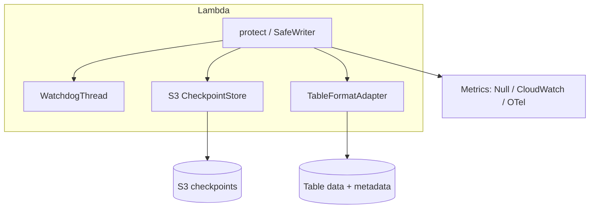

# Architecture

## Problem

Lambda `SIGKILL` at timeout can leave Parquet on S3 without Iceberg/Delta/Hudi metadata — **silent data loss**.

## Solution

IceGuard arms a **watchdog** on remaining Lambda time, writes in **checkpoint_interval** chunks, persists progress to **S3**, and on timeout:

1. Aborts format transaction (when catalog wired)
2. Deletes uncommitted paths from `track_paths`
3. Raises `IceGuardRollbackError` (visible failure, not silence)

## Components

## Chunked write contract

- **Protected:** `writer.write(...)` and `write_dataframe(...)`
- **Not protected:** single blocking `df.write.save()` inside `protect()` only

## Multi-Lambda

`Coordinator` implements 2PC-style state in the checkpoint bucket. Pass `coordinator_id` to prefix idempotency keys.

## Durable execution

`DurableCheckpointBridge` mirrors S3 checkpoints to Lambda durable execution `checkpoint()` when the runtime provides it.
